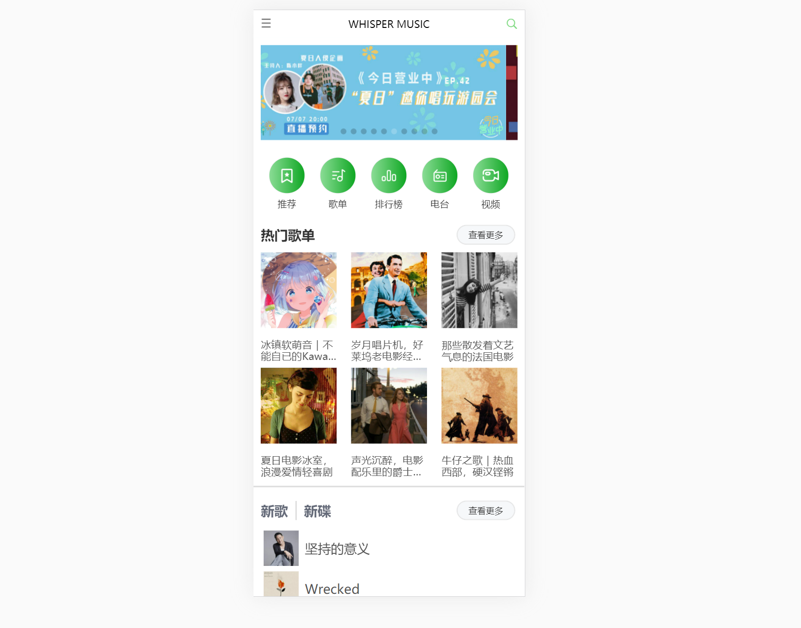

# vue-whisper
vue-cli3音乐单页面应用

[演示链接](https://spinachhh.github.io/vue-whisper/dist/index.html)

项目使用[vue-cli3](https://cli.vuejs.org/zh/guide/)构建,由于歌曲资源问题，可能会出现播放不了的问题。

whisper2.0版已经上线，使用neteasecloudmusicapi的网易云音乐api接口进行改版

源码请参考
[whisper2.0](https://github.com/spinachhh/whisper2.0)

------------------------------------------------------------------------------------------------------
[参考](https://github.com/uncleLian/vue2-echo)
